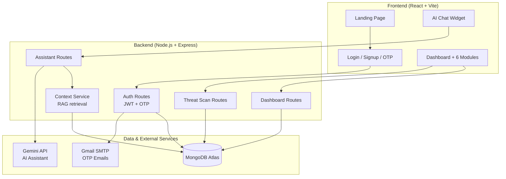

# CyberIntel

A unified cybersecurity intelligence platform — built by **Aliya Nishath**, Final Year Cybersecurity Student (2026–2027).

CyberIntel combines biometric authentication, AI-driven threat detection, real-time monitoring, and risk analysis into a single console, with a Suspicious Web Threat Detection module as an enhancement on top of the original mini-project.

---

## Architecture



---

## How Real Data Flows Through the System

1. A user logs in, signs up, or scans a URL
2. The backend evaluates it (wrong password 3x, wrong role, malicious URL, etc.)
3. If it's suspicious, a real `Threat` document is created in MongoDB
4. The Dashboard, Risk, AI Threat, Monitoring, and Reports pages all query that same
   collection — so every chart reflects genuine activity, not hardcoded numbers
5. The AI Assistant retrieves this same data (risk score, open threats, login
   history) before answering questions — a RAG (Retrieval-Augmented Generation)
   pattern, not a generic chatbot

---

## Tech Stack

| Layer | Technology |
|---|---|
| Frontend | React, Vite, React Router, Recharts, Lucide Icons |
| Backend | Node.js, Express |
| Database | MongoDB Atlas (Mongoose) |
| Auth | JWT, bcrypt, email OTP (Nodemailer + Gmail SMTP) |
| AI | Google Gemini API, RAG-grounded via a custom context service |
| Threat Detection | Custom heuristic URL scanner (HTTPS check, IP-based URLs, link shorteners, risky TLDs, phishing keywords, brand impersonation) |

---

## Project Structure

```
cyberintel/
├── frontend/
│   └── src/
│       ├── pages/
│       │   ├── LandingPage.jsx
│       │   ├── AuthPages.jsx
│       │   ├── DashboardApp.jsx        (Dashboard + all modules)
│       │   └── PublicInfoPage.jsx      (About/Users/Builders/Goal)
│       └── components/
│           └── AiChatWidget.jsx
│
└── backend/
    └── src/
        ├── models/
        │   ├── user.js
        │   ├── LoginHistory.js
        │   └── Threat.js
        ├── controllers/
        │   ├── authController.js       (signup, OTP, login, role promotion)
        │   ├── dashboardController.js  (real data for all modules)
        │   ├── threatScanController.js (URL threat scanner)
        │   └── assistantController.js  (RAG-grounded AI chat)
        ├── services/
        │   └── contextService.js       (real-data retrieval for the AI)
        ├── utils/
        │   ├── urlScanner.js           (heuristic detection engine)
        │   ├── email.js, otp.js, token.js
        └── routes/
```

---

## Core Modules & Cyber Security Tools

### Core Platform
1. **Biometric Authentication** — WebAuthn Passkeys (Face ID, Touch ID, Windows Hello) with native hardware security.
2. **AI-Based Threat Detection** — Real threats surfaced from actual platform telemetry and anomaly scoring.
3. **Threat Intelligence & Risk Analysis** — Dynamically calculated risk score grouped by real threat category.
4. **Real-Time Monitoring & Alerts** — Live alert feed, audio sirens, and red flash notifications.
5. **Security Dashboard & Reports** — Aggregated threat metrics over time with exportable audit reports.
6. **URL Threat Scanner** *(enhancement module)* — Heuristic detection engine checking for phishing, brand impersonation, risky TLDs, and IP URLs.
7. **AI Cyber Duel Arena** — Real-time adversarial Red vs. Blue team wargaming simulator with MITRE ATT&CK integration and plain-language ELI5 translation.

### Newly Added Cyber Security Tools & Intelligence
8. **Data Leak & Account Breach Checker** — Live lookup checking if emails/accounts have surfaced in 15+ billion compromised records, with risk scoring, exposed data class breakdowns, and immediate remediation workflows.
9. **Pwned Passwords Zero-Knowledge Scanner** — Implementation of HaveIBeenPwned's k-Anonymity SHA-1 hash prefix protocol (100% privacy-preserving, zero plain password transmission) + NIST SP 800-63B entropy calculator & crack time estimator.
10. **Verified Breach Detection Websites Directory** — Curated intelligence hub profiling the top 10 verified leak detection websites (Have I Been Pwned, XposedOrNot, DeHashed, Intelligence X, Hudson Rock Cavalier, Leak-Lookup, Mozilla Monitor, BreachDirectory, Snusbase, Google Password Checkup) with live filter and direct query launch buttons.
11. **HTTP Security Headers & SSL Posture Analyzer** — Inspects web applications for HSTS, CSP, X-Frame-Options, X-Content-Type-Options, Referrer-Policy, Permissions-Policy, with security grade (A+ to F) and copy-paste remediation directives.
12. **IP Address & Threat Investigator** — Live IP OSINT lookup returning ASN routing, Geolocation, Tor Exit Node indicators, VPN/Hosting proxies, and threat confidence scores.
13. **SOC Incident Response Playbooks** — Interactive NIST SP 800-61r2 standardized triage workflows for Account Takeover (ATO), Phishing, Ransomware Containment, and Data Exfiltration.

---

## Real vs. Sample Data — Transparency

Every module page includes a "Real talk" callout explaining exactly which numbers
are calculated from your MongoDB data and which are still placeholders. This was
a deliberate design choice, not an oversight — a system should be honest about
its own limitations.

---

## Setup

**Backend:**
```bash
cd backend
cp .env.example .env   # fill in MongoDB URI, Gmail credentials, Gemini API key
npm install
npm run dev
```

**Frontend:**
```bash
cd frontend
npm install
npm run dev
```

Visit `http://localhost:5173`.

---

## 👩‍💻 Author & Developer

**Built by Aliya Nishath** — Final Year Cybersecurity Student (2026–2027)

- 💼 **LinkedIn**: [linkedin.com/in/aliya-nishath-82a6b2375](https://www.linkedin.com/in/aliya-nishath-82a6b2375/)
- 🐙 **GitHub**: [@AliaNishath](https://github.com/AliaNishath)
